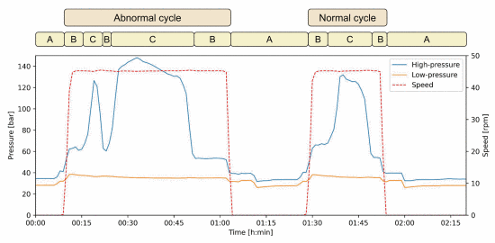
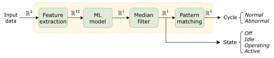

# Tinyml anomaly detection for industrial machines with periodic duty cycles

Code associated with the publication ["Tinyml anomaly detection for industrial machines with periodic duty cycles" at the Sensor Application Symposium 2024](https://ieeexplore.ieee.org/abstract/document/10636584/).
It contains a jupyter notebook to train/test the ML models and the c-code to run the models on microcontrollers. 

## Data
The original csv input data file ('Confidential_Drive_data_Jun2021.csv') are no available due to 
The csv input files ('Confidential_Drive_data_Jun2021.csv', 'Confidential_Drive_data_Okt2021.csv','Confidential_Drive_data_Jan2022.csv' and 'Confidential_Drive_data_April2022.csv') are not available due to conflicts of interest of the parties involved in this project.
However, an "input_data.csv" example file is provide to evaluate the models.

## Requirements
See the 'requirement.txt' file

## Cite
If you use this code or the paper, please cite as:

L. S. Martinez-Rau, Y. Zhang, B. Oelmann and S. Bader, "TinyML Anomaly Detection for Industrial Machines with Periodic Duty Cycles," 2024 IEEE Sensors Applications Symposium (SAS), Naples, Italy, 2024, pp. 1-6, doi: 10.1109/SAS60918.2024.10636584.

or use the BibTeX:

@INPROCEEDINGS{10636584,
  author={Martinez-Rau, Luciano Sebastian and Zhang, Yuxuan and Oelmann, Bengt and Bader, Sebastian},
  booktitle={2024 IEEE Sensors Applications Symposium (SAS)}, 
  title={TinyML Anomaly Detection for Industrial Machines with Periodic Duty Cycles}, 
  year={2024},
  volume={},
  number={},
  pages={1-6},
  keywords={Productivity;Machine learning algorithms;Recurrent neural networks;Microcontrollers;Tiny machine learning;Belts;Real-time systems;anomaly detection;conveyor belt;industry 4.0;low-power microcontroller;machine learning;maintenance;tinyML},
  doi={10.1109/SAS60918.2024.10636584}}
